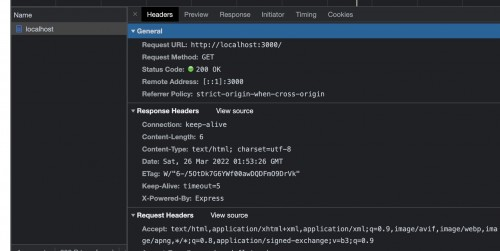
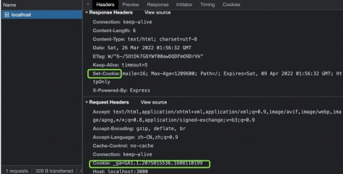
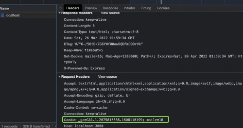
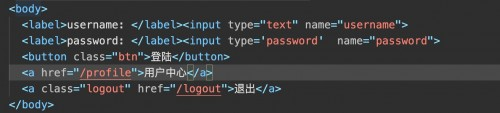
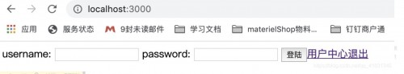

## 为什么需要 Cookie 和 Session?

说起来为什么需要 Cookie ，这就需要从浏览器开始说起，我们都知道浏览器是没有状态的(HTTP 协议无状态)，这意味着浏览器并不知道是张三还是李四在和服务端打交道。这个时候就需要有一个机制来告诉服务端，本次操作用户是否登录，是哪个用户在执行的操作，那这套机制的实现就需要 Cookie 和 Session 的配合。

# cookie

## 什么是cookie?

* **HTTP 是无状态的协议（对于事务处理没有记忆能力，每次客户端和服务端会话完成时，服务端不会保存任何会话信息** ）：每个请求都是完全独立的，服务端无法确认当前访问者的身份信息，无法分辨上一次的请求发送者和这一次的发送者是不是同一个人。所以服务器与浏览器为了进行会话跟踪（知道是谁在访问我），就必须主动的去维护一个状态，这个状态用于告知服务端前后两个请求是否来自同一浏览器。而这个状态需要通过 cookie 或者 session 去实现。
* **cookie 存储在客户端：** cookie 是服务器发送到用户浏览器并保存在本地的一小块数据，它会在浏览器下次向同一服务器再发起请求时被携带并发送到服务器上。
* **cookie 是不可跨域的：** 每个 cookie 都会绑定单一的域名，无法在别的域名下获取使用，**一级域名和二级域名之间是允许共享使用的** （**靠的是 domain）** 。

## 代码测试

创建项目：mkdir cookie

进入项目：cd cookie

安装依赖：npm init - npm install express

创建一个index.js文件

```js
var express = require('express')
var app = express();
app.get('/',(req,res)=> {
    // res.cookie('maile', 16, {
    //     maxAge: 14 * 86400 * 1000, // 14天的有效期
    //     httpOnly: true // js脚本无法读取cookie,能有效的防止xss脚本攻击 没有这个属性document.cookie可以获取cookie
    // })
    res.send('首页')
})
app.listen(3000);
 
// cookie解决http无状态, 存在浏览器，不安全。服务端告诉浏览器，把这个cookie存下来
// session 存在服务器，
//Session：记录一系列状态, 不是 独立存在的，依赖于cookie。通常用于登陆验证
 
//Session与cookie功能效果相同。Session与Cookie的区别在于Session是记录在服务端的，而Cookie是记录在客户端的。
```

运行项目node index.js

访问locallhost:3000

会看到控制台没有携带任何的cookie信息：



把cookie相关代码带上：

```js
res.cookie('maile', 16, {
        maxAge: 14 * 86400 * 1000, // 14天的有效期
        httpOnly: true // js脚本无法读取cookie,能有效的防止xss脚本攻击 没有这个属性document.cookie可以获取cookie
    })
```

重新启动服务器再看下，第一次刷新页面，会看到相应头中带有cookie，而请求头重并没有，再刷新下页面，就可以看到请求头中也带有这条cookie：



刷新后，多了一条：



可以看到两个地方都又cookie，之后的请求都会带上这个cookie。但是这样有缺点，就是cookie可以被修改。也不能存放敏感信息，不安全，另外，存放量不能太大。

## 什么是session?

* session 是另一种记录服务器和客户端会话状态的机制
* session 是基于 cookie 实现的，session 存储在服务器端，sessionId 会被存储到客户端的cookie 中

## **session 认证流程：**

* 用户第一次请求服务器的时候，服务器根据用户提交的相关信息，创建对应的 Session
* 请求返回时将此 Session 的唯一标识信息 SessionID 返回给浏览器
* 浏览器接收到服务器返回的 SessionID 信息后，会将此信息存入到 Cookie 中，同时 Cookie 记录此 SessionID 属于哪个域名
* 当用户第二次访问服务器的时候，请求会自动判断此域名下是否存在 Cookie 信息，如果存在自动将 Cookie 信息也发送给服务端，服务端会从 Cookie 中获取 SessionID，再根据 SessionID 查找对应的 Session 信息，如果没有找到说明用户没有登录或者登录失效，如果找到 Session 证明用户已经登录可执行后面操作

## 代码测试

这里用koa来实现。

构建项目session

初始化 npm init

安装依赖 cnpm i koa koa-router koa-parser koa-session `koa-static` -D

简单demo

```js
const Koa = require('koa');
const Route = require('koa-router');
const session = require('koa-session');
const static = require('koa-static');
const body = require('koa-parser')
let app = new Koa();
// 处理post
app.use(body());
let router = new Route()
// 加密cookie用，可以随意写一个string
app.keys = [
    'dhkjshafkd932402',
    'ieywoqyr8439743243',
    'jklfdsufiequ4353454'
]
app.use(session({
  cookie: {
    path: '/',           // 项目根路径，表示cookie用于整个项目
    httpOnly: true,      // 禁止客户端通过js脚本修改cookie
    maxAge: 24 * 60 * 60 * 1000  // cookie过期时间 这里设置1天
  }
}, app))
router.post('/login', async ctx => {
    var { username = '', password = '' } = ctx.request.body
    if(username === '麦乐' && password === '123456') {
        ctx.session.user = username;
        ctx.body = {
            code: '200'
        }
        console.log('登陆成功')
    } else {
        ctx.body = {
            code: '401'
        }
        console.log('登陆失败')
    }
  
})
router.get('/profile', async ctx => {
   console.log(ctx.session)
   // 如果拿不到session中的user信息，说明未登陆
    if(!ctx.session.user) {
        ctx.body = `<a href='/'>请返回登陆</a>`
    }else {
       // 用户已经登陆
        ctx.body = `用户中心`
    }
})
router.get('/logout', async ctx => {
    ctx.session.user = null
    ctx.body = `<a href='/'>请返回登陆</a>`
})
app.use(router.routes());
app.use(static(__dirname + '/static'))
app.listen(3000)
```

static/index.html文件



```js
<script src="http://code.jquery.com/jquery-1.4.1.min.js"></script>
<script>
  $(function() {
  
        $('.btn').click(function() {
            var username = $(':text').val();
            var password = $(':password').val();
            console.log(username, password)
            $.post('/login',{
                    username,
                    password
                },
                function(data) {
                    console.log(data)
                }
            )}
        )
 
    })
</script>
```



session的缺陷是，如果采用负载均衡分布式服务器，就可能会出现这样的情况：

一个用户的session保存在a服务器上，但是却请求到了b服务器，就会获取不到用户信息。这样就需要在不同的服务器之间不同的复制seeion，会给服务器增加很大的负担。有人提议要把所有seeion放在一台机器上，这样就不用复制来复制去了，但是如果存储session的服务器挂了，那所有的用户都登陆不了了。为了解决上述的一些不足，就有了下面token的产生。

# token

## token组成

uid(用户唯一的身份标识)、time(当前时间的时间戳)、sign（签名，token 的前几位以哈希算法压缩成的一定长度的十六进制字符串）。

## 验证流程

1. 客户端使用用户名跟密码请求登录
2. 服务端收到请求，去验证用户名与密码
3. 验证成功后，服务器用一个只有服务器才知道的密钥，和一定的加密算法（目的是为了掩盖敏感信息），生产一个签名，发送客户端。
4. 客户端收到 token 以后，会把它存储起来，比如放在 cookie 里或者 localStorage 里
5. 客户端每次向服务端请求资源的时候需要带着服务端签发的 token
6. 服务端收到请求，然后去验证客户端请求里面带着的 token ，用自己的密钥和加密算法去解密，然后生成新的签名，跟token中带有的签名对比，作出登陆状态判断，如果验证成功，就向客户端返回请求的数据

## 优点

* 基于 token 的用户认证是一种服务端无状态的认证方式，服务端不用存放 token 数据。用解析 token 的计算时间换取 session 的存储空间，从而减轻服务器的压力，减少频繁的查询数据库
* token 完全由应用管理，所以它可以避开同源策略
* 支持分布式
